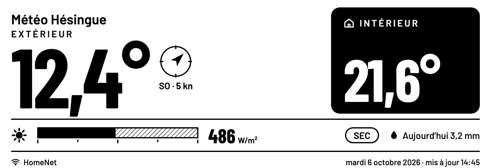
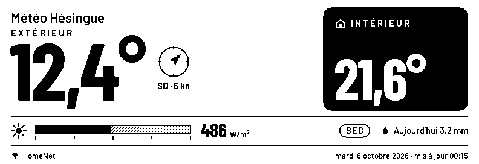
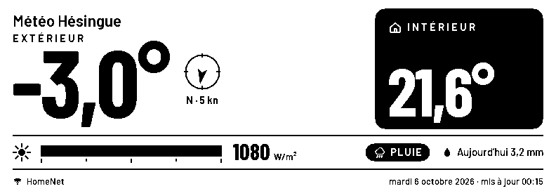

# eink-weather — Météo Hésingue

ESP-IDF firmware that shows a personal **Ecowitt** weather station on a
**CrowPanel ESP32-S3 5.79" e-paper** display: indoor/outdoor temperature, rain now /
rain today, solar irradiance gauge, wind direction and speed. It refreshes every
15 minutes on the wall clock (:00, :15, :30, :45) and deep-sleeps in between.



| Firmware render (dry) | Firmware render (raining) |
|---|---|
|  |  |

- Product spec (content, states, schedule, data mapping): [`docs/SPEC.md`](docs/SPEC.md)
- How the display is driven, plus lessons learned: [`docs/DISPLAY_NOTES.md`](docs/DISPLAY_NOTES.md)

---

## 1. Hardware / platform

| Item | Value |
|---|---|
| Product | Elecrow **CrowPanel ESP32 E-Paper HMI 5.79-inch Display**, model **DIS08792E** |
| Wiki | https://www.elecrow.com/wiki/CrowPanel_ESP32_E-paper_5.79-inch_HMI_Display.html |
| Vendor code (GitHub) | https://github.com/Elecrow-RD/CrowPanel-ESP32-5.79-E-paper-HMI-Display-with-272-792 |
| Schematic & PCB | https://www.elecrow.com/download/product/CrowPanel/E-paper/5.79-DIS08792E/CrowPanel-ESP32-Display-5.79E-Inch.zip |
| Vendor Arduino demos / examples | `…/5.79-DIS08792E/Arduino/Demos.zip`, `…/Arduino/Examples.zip` (same download path as above) |
| MCU module | **ESP32-S3-WROOM-1-N8R8** (dual-core Xtensa LX7, up to 240 MHz), **8 MB flash, 8 MB PSRAM** |
| Chip seen by esptool | ESP32-S3 (QFN56), revision v0.2 |
| Panel | 5.79" AM EPD, **792 × 272 px**, black/white, active area 139.00 × 47.74 mm |
| Panel controllers | **2 × SSD1683** (master + slave, cascaded; each drives 396 columns) |
| Panel interface | SPI (bit-banged by the vendor driver), see pin map |
| USB | USB-C, WCH USB-serial bridge (USB VID 0x1A86, enumerates as "USB Serial"; macOS port `/dev/cu.usbserial-*`) |
| Power | USB-C 5 V; 3.7 V Li-ion via SH1.0 2-pin connector (on-board charger). **Not from a power bank**: it cuts off during deep sleep (see display notes) |
| Other I/O (unused) | Menu IO2, Exit IO1, rotary Up IO6 / Down IO4 / Conf IO5, TF card (MOSI IO40, MISO IO13, CLK IO39, CS IO10) |

### E-paper pin map (from the vendor driver, `components/crowpanel_epd/spi.h`)

| Signal | GPIO |
|---|---|
| SCK | 12 |
| MOSI (DIN) | 11 |
| CS | 45 |
| D/C | 46 |
| RES (reset) | 47 |
| BUSY (input) | 48 |
| Panel power enable (high = on) | 7 |

The wiki does not list these; they come from Elecrow's example code.

## 2. Toolchain (pinned, so it can be rebuilt later)

| Component | Version |
|---|---|
| ESP-IDF | branch `release/v5.0`, commit **`d9f9b7d`** (`git describe`: v5.0.8-452-gd9f9…) |
| Compiler | `xtensa-esp32s3-elf` **esp-2022r1, GCC 11.2.0** (installed by `idf_tools.py`) |
| Python | 3.9 (macOS system Python works); ESP-IDF venv `idf5.0_py3.9_env` |
| Host tools | CMake + Ninja (Homebrew), Git |
| Asset generator | Python 3 + Pillow (only to regenerate fonts/icons) |

Setup on a fresh Mac/Linux box, keeping all ESP-IDF tools **inside this project**
(`./.espressif`, git-ignored):

```sh
git clone -b release/v5.0 --recursive https://github.com/espressif/esp-idf.git ~/devl/esp-idf
git -C ~/devl/esp-idf checkout d9f9b7d && git -C ~/devl/esp-idf submodule update --init --recursive
export IDF_TOOLS_PATH=$PWD/.espressif IDF_PATH=~/devl/esp-idf
python3 $IDF_PATH/tools/idf_tools.py install --targets esp32s3
python3 $IDF_PATH/tools/idf_tools.py install-python-env
```

Then in every shell: `source tools/env.sh`.

## 3. Credentials (never committed)

Create two files in the project root (both are in `.gitignore`):

```
# wifi_creds
SSID=<your network>
PASSWORD=<your password>

# ecowitt_creds   (from ecowitt.net → User Center → Private Center)
api_key=<API key>
app_key=<Application key>
```

CMake reads them and generates `secrets.h` in the build folder only. The station
MAC is discovered with `/device/list` and cached in NVS (override:
`CONFIG_ECOWITT_MAC`). The secrets end up in the firmware image, so treat a
flashed board as holding them.

## 4. Build, flash, monitor

```sh
source tools/env.sh
idf.py build
idf.py -p /dev/cu.usbserial-XXXX flash monitor     # Ctrl-] to quit
```

Settings: `idf.py menuconfig` → **Weather display** (refresh minutes, fetch lead
30 s, wake lead 60 s, POSIX timezone, station MAC). After changing Kconfig
options, run `idf.py reconfigure` if a new `CONFIG_…` symbol is not found.

Expected log per cycle: `Timer wake` → Wi-Fi connected → `RTC drift …` →
`ecowitt: in …C out …C | rain … | solar … | wind …` → `Panel updated` →
`Slot ready N s early` → `Deep sleep for N s`.

## 5. Preview the screen without hardware

```sh
tools/preview/ui_preview.sh      # → build/preview/*.png (dry, raining, stale, no data)
```

`main/ui.c` is plain C with no ESP-IDF dependency; the script compiles it for the
host and writes PNGs. Regenerate fonts/icons after changing sizes or glyphs:
`python3 tools/gen_assets.py` (downloads Barlow from google/fonts into `build/fonts/`).

## 6. Repository layout

```
main/
  app_main.c        boot: NVS → Wi-Fi → one poller cycle
  poller.c          wake cycle, slot schedule, deep sleep, RTC drift calibration
  diag.c            post-mortem log (hang vs power loss), cycle watchdog
  wifi.c            STA connect with backoff
  timesync.c        SNTP + timezone
  ecowitt.c         Ecowitt API v3 client (HTTPS, cJSON)
  display.c         panel power + refresh sequence (vendor driver glue)
  ui.c              layout B (French), drawing primitives, text
  ui_assets.c/.h    GENERATED 1-bit fonts and icons
  weather.h         shared data types
  Kconfig.projbuild settings
  secrets.h.in      template filled from the creds files at build time
components/crowpanel_epd/   Elecrow driver (adapted from Arduino) + compat shim
tools/env.sh                ESP-IDF shell for this project
tools/gen_assets.py         font/icon generator
tools/preview/              host preview harness
docs/                       spec, display notes, images
```

## 7. Licenses

Own code: no license chosen yet (all rights reserved by the author). Barlow fonts: SIL OFL 1.1. Elecrow driver: see
[`THIRD_PARTY_LICENSES.md`](THIRD_PARTY_LICENSES.md).
